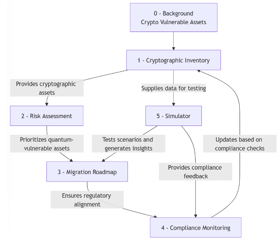
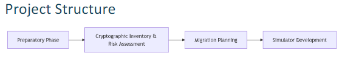

# CS458: Introduction to Cryptography

This repo was created for the needs of the course "Introduction to Cryptography" at the Computer Science Department of the University of Crete.

## Contributors

- CSD4676 Dimitrios Makrogiannis
- CSD4337 Alexandros Markodimitrakis
- CSD4531 Panagiwta Latsi
- CSD4555 Maria Kakoulidou

## Project Description

This  project  focuses  on  building  a crypto  agility framework designed  to facilitate  transition from  cryptographically  vulnerable  to  cryptographically  strong primitives.  That  includes  the  transition of Post-Quantum  Cryptography (PQC) algorithms into existing infrastructures.

## Project Model

The following figure illustrates the model of the project.

## Project Implementation

The project will be divided into the following parts:

- **Crypto Agility Framework**: CSD4531 Panagiwta Latsi, CSD4555 Maria Kakoulidou
- **Cryptographic Inventory &Risk Assessment**: CSD4337 Alexandros Markodimitrakis
- **Cryptographic Migration Plan**: CSD4531 Panagiwta Latsi, CSD4555 Maria Kakoulidou
- **Simulator Development**: CSD4676 Dimitrios Makrogiannis

## Project Guidelines

You can find the project guidelines [here](docs/project_guidelines.pdf).

## Project Report

You can find the project report [here](docs/project_report.pdf).

## License

This project is licensed by us. We will find you if you use it without our permission.
